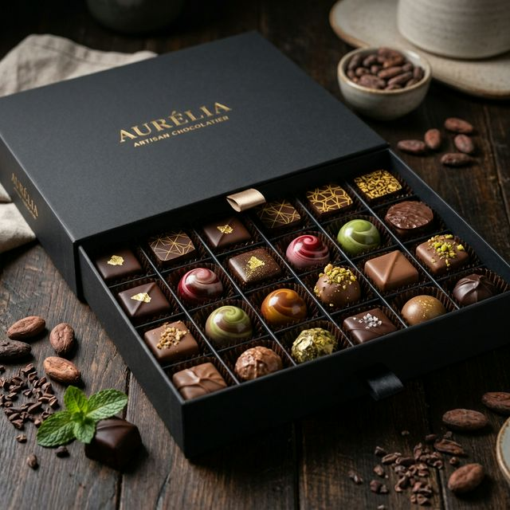

# Noir Luxe - Premium Artisan Chocolate (Demo Website)



> **Note:** This is a **demo website build** created to showcase modern web development techniques, responsive design, and performance optimization. It is not an actual ecommerce store.

## 🌟 Overview

**Noir Luxe** is a landing page for a fictional premium artisan chocolate brand. The project demonstrates a clean, luxurious UI/UX with a focus on immersive aesthetics, smooth animations, and high performance.

## ✨ Key Features

- **Premium UI/UX:** Dark mode aesthetics with glassmorphism effects, a curated typographic scale (Playfair Display & Lato), and a bespoke color palette tailored for luxury.
- **Scroll Sequence Hero:** A scroll-controlled image sequence hero section (using `<canvas>` and pre-rendered WebP frames) that unwraps a chocolate truffle as the user scrolls down.
- **Performance Optimized:** 
  - Lightweight DOM structure
  - Batch-converted WebP image assets for minimal payload
  - Lazy-loading for off-screen assets
- **Responsive Design:** Fluid layouts and a mobile-optimized hamburger navigation menu ensuring a seamless experience across all device sizes.
- **Theming:** Integrated Light/Dark mode toggle that persists user preference.
- **Form Integration:** A "Request Access" waitlist form pre-wired for backend services (e.g., Formspree).
- **SEO Ready:** Complete OpenGraph tags, semantic HTML5 structure, and meta descriptions optimized for search engines.

## 🛠️ Tech Stack

- **Core:** HTML5, Semantic DOM, CSS3, Vanilla JavaScript
- **Styling:** Custom CSS with CSS Variables for theming, CSS Grid & Flexbox, micro-animations
- **Tooling:** [Vite](https://vitejs.dev/) for blazing fast development, HMR, and optimized production builds.

## 🚀 Getting Started

To run this project locally, you need [Node.js](https://nodejs.org/) installed on your machine.

1. **Clone the repository:**
   ```bash
   git clone https://github.com/your-username/noir-luxe.git
   cd "noir-luxe"
   ```

2. **Install dependencies:**
   ```bash
   npm install
   ```

3. **Run the development server:**
   ```bash
   npm run dev
   ```
   *The site will be available at `http://localhost:5173`.*

4. **Build for production:**
   ```bash
   npm run build
   ```
   *The optimized static assets will be generated in the `dist/` folder.*

## 🎨 Design System

- **Primary Font:** Playfair Display (Headings)
- **Secondary Font:** Lato (Body text)
- **Colors:** Deep espresso/charcoal background (`#0A0908`), subtle gold accents (`#D4AF37`), and soft off-white text (`#F4F4F9`).

## 📜 License

This project is intended for demonstration purposes. Feel free to use the code structure and animations as inspiration for your own projects!
